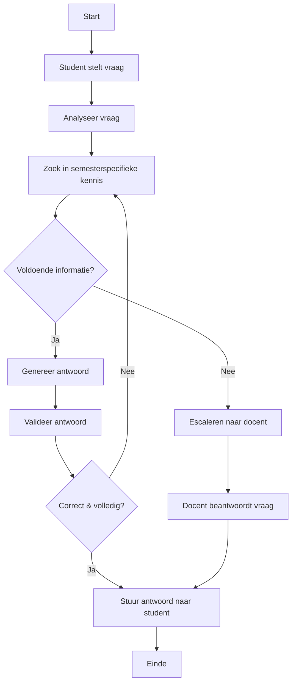

# Sprint 1 – Workflow Diagram

## Overzicht Research Workflow

---

## Uitleg per stap

### 1. Analyse
De vraag wordt geclassificeerd (deadline, inhoud, beoordeling, planning).

### 2. Retrieval
De agent raadpleegt interne bronnen zoals studiewijzers en projectdocumentatie.

### 3. Generatie
Op basis van gevonden informatie genereert het LLM een antwoord.

### 4. Validatie
Controle op:
- Relevantie
- Bronverwijzing
- Volledigheid
- Confidence score

### 5. Escalatie
Bij onvoldoende informatie of lage confidence wordt de vraag doorgestuurd naar de docent.

---

## Technische implicaties voor volgende sprint
- Orchestration nodig
- State management nodig
- Retrieval (RAG) implementatie
- Validatielogica
- Escalatiemechanisme
